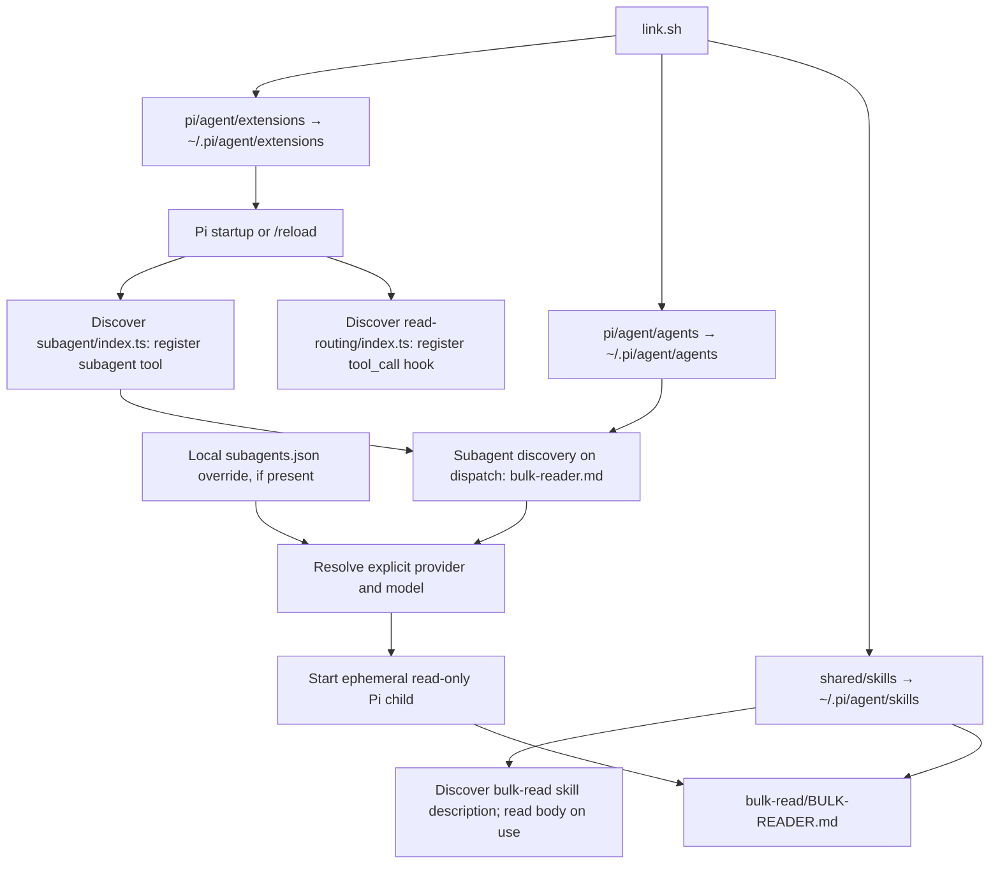
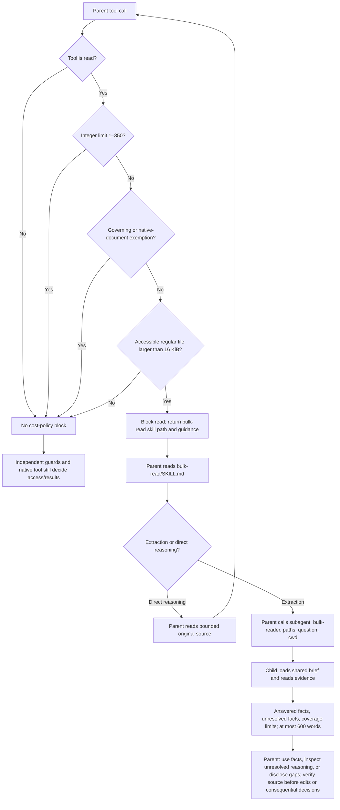

# Pi bulk-read routing

The shared instructions and `bulk-read` skill direct the parent to delegate broad factual discovery across source, tests, and reference files before reading their bodies. The parent locates candidate paths with focused searches and supplies the factual questions its answer needs. The worker returns answered facts with source support, unresolved facts, and coverage limits. The parent uses supported facts directly, inspects original source for unresolved reasoning or edits, and discloses remaining gaps rather than repeating the worker's investigation. Small lookups and required complete reads remain direct.

This extension is a backstop for oversized broad reads, not the workflow's entry requirement. It is a **redirect, not automatic dispatch**: the hook blocks a broad read; the parent supplies the question and calls `bulk-reader` through the shared skill. Worker-first discovery is instruction-driven; the hook does not enforce it.

## Why the parent can still read 350 lines repeatedly

[`routing.ts`](routing.ts) allows any positive integer `limit` from 1 through 350, even without an offset. It keeps no per-file or per-session read history. Four successive reads at offsets 1, 351, 701, and 1051 therefore pass. A parent that starts with bounded reads never sees a redirect.

This preserves direct source inspection for debugging, editing, architecture, safety-critical reasoning, and instructions that must be read completely. Those tasks still delegate broad factual discovery; the parent retains judgment and the source needed to support it. It also means **passing hook tests does not demonstrate delegation or context savings**. Repeated full-file paging for discovery is a workflow-adoption failure, not a broken size check.

Since the gate became size-based, the allowance is no longer implied by it: a blocked file of at most 350 lines can still be returned whole by one bounded read. That is deliberate. Tightening the allowance was considered and rejected — one extra read turn costs more than a whole delegation on a large parent context — so the skill's no-evasion rule, not the hook, is what keeps bounded reads honest. See [EXT-10](../../../../decisions/extensions.md).

Broad reads route when a regular file is **larger than 16 KiB**, measured in bytes with no line counting. Encoding does not matter: multi-byte characters count their bytes. The gate is independent of Bash output limiting, and Pi's native output truncation still applies separately.

The threshold is a cost threshold, and size is the better proxy for cost. Measured across one prose file and one code file, characters per token stayed near 3.6 while tokens per line varied roughly fourfold, so a line count over- or under-routes depending on content type. 16 KiB is about 4,550 tokens, which clears single-pass delegation break-even for both `claude-opus-5` and `claude-sonnet-4-6`; see [the measurements](#measured-parent-context-reduction) and [EXT-10](../../../../decisions/extensions.md).

## Provisioning and discovery

Run `./link.sh` from the repository root for initial setup; see the [setup guide](../../../../README.md). Existing correct links are left alone; conflicting paths are refused unless `--force` is explicitly supplied, which backs them up first. No Portal service or package installation is needed for this route.



Directory symlinks make new canonical files available without relinking. Start a new Pi session or run `/reload` to refresh extensions and skills. Agent definitions are discovered at dispatch. Credentials, installed models/providers, and optional `~/.pi/agent/subagents.json` overrides remain local; linking does not provision them.

The canonical [agent definition](../../agents/bulk-reader.md) pins `openai-codex/gpt-5.6-luna` and permits only `read` and `grep`. A local model override wins. The [subagent runtime](../subagent/README.md) passes explicit provider/model arguments; an unpinned agent inherits the parent. Do not assume the effective worker is cheaper merely because its role is named `bulk-reader`.

## Runtime routing



Exemptions include governing filenames such as `AGENTS.md`, `SKILL.md`, `CONTEXT.md`, and `DECISIONS.md`; Markdown under skills/agents/adr/adrs/decisions or `.claude/rules`; and native image, PDF, and notebook inputs. Both the requested path and resolved symlink target can qualify. Missing or inaccessible paths defer to the native tool.

The hook resolves the path, applies the exemptions, and compares the resolved file's size against the threshold. It never opens the file, so it cannot hang on a FIFO, return contents, or grant access. The hook does not intercept Bash or count cumulative reads. The child starts with `--no-extensions` plus the sandbox extension explicitly enabled: it does not recursively load read-routing or the subagent extension. Worker failures or inadequate evidence call for an explicit limitation and permitted bounded direct inspection—not silent model substitution.

## Automated checks

From the repository root:

```bash
bun test pi/agent/extensions/read-routing
bun test pi/agent/extensions/subagent
bun test pi/agent/extensions
```

The routing suite checks:

- Shared size boundaries, bounded/unbounded inputs, exemptions, path aliases, and missing files.
- Empty files, the exact 16 KiB boundary in both directions, CRLF and blank-line byte costs, long single lines, and multi-byte content measured as bytes.
- Pi `file://` URLs, including encoded filenames, preserve routing and exemptions.
- Exact limits 1, 350, and 351, and invalid numeric limits.
- The registered `tool_call` handler returns a block with the skill path and worker name.
- After a block, repeated 350-line reads still pass; an offset-only or 351-line read still blocks.
- Unrelated tools receive no cost-policy decision.

These are deterministic policy and handler-contract tests. The handler uses a stub API: they do **not** start Pi, call a model, prove skill compliance, or measure savings. The subagent suite separately covers agent ownership/brief pointers and model selection. Keep model-dependent evaluation outside the fast unit suite.

## Live evaluation: test four separate claims

Use synthetic, non-sensitive references in a disposable evaluation repository readable by both parent and child. Arbitrary files in a parent's `PI_SESSION_TMPDIR` are not readable by its child; use a repository-local scratch directory for these intentionally shared test fixtures, not a copied protected artifact. Do not paste their contents into the parent prompt or use a CLI file attachment: the test must exercise tool reads. Start fresh sessions with the same parent model and thinking level; record the effective worker model and any overrides.

Create these fixtures once from the evaluation repository root, outside the measured sessions. Use a gitignored scratch directory and remove it after testing:

```bash
python3 - <<'PY'
from pathlib import Path

root = Path('.agent-report-bulk-read-eval').resolve()
root.mkdir(exist_ok=True)
for name in ('alpha', 'beta', 'gamma'):
    lines = [f'Reference entry {n:04d}: background material, no operational setting.\n'
             for n in range(1, 1401)]
    for line, key, value in ((80, 'owner', name + '-ops'),
                             (480, 'timeout_ms', '2400'),
                             (880, 'retry_limit', '4'),
                             (1280, 'region', 'eu-west-1')):
        lines[line - 1] = f'{key} = {value}\n'
    path = root / (name + '.txt')
    path.write_text(''.join(lines))
    print(path)
PY
```

Each file has 1,400 lines. The four facts occur at lines 80, 480, 880, and 1280, so an initial 350-line read cannot cover the assignment. Keep fixture creation and ground truth out of the measured parent sessions. Verify that the worker is allowed to read the fixture location; do not bypass a permission denial.

The fixtures below predate the byte-only gate; their 1,400-line files are far above 16 KiB, so the probes still hold.

| Claim | Probe | Evidence required |
| --- | --- | --- |
| Hook activates | Ask the parent to attempt one `read` on an explicit fixture path with neither offset nor limit. | Actual tool arguments and blocked result containing the skill path. If the model adds a limit, the probe did not exercise the broad-read gate. |
| Worker works | Explicitly request the bulk-read skill to extract the four settings from all three paths, with citations and a note about missing `retention_days`. | A `bulk-reader` call, correct settings/locations, honest coverage, no invented retention value, no writes, and concise output. This proves worker capability, not spontaneous routing. |
| Parent adopts it | In a fresh session ask: “Extract owner, timeout_ms, retry_limit, region, and retention_days from these three reference files; cite sources and flag missing values.” Supply paths only; do not mention delegation or limits. | Correct answer plus actual delegation, whether proactive or after a block. Record full-file paging as a missed adoption outcome; targeted searches or small follow-up reads are not automatically failures. |
| Direct inspection survives | Request original-source inspection of a specific section using an explicit offset and limit. | Successful bounded read without a forced worker; independent access controls still apply. |

Repeat the natural extraction probe at least three times per parent model. Inspect actual tool arguments: a displayed excerpt of about 350 lines does not establish that the model requested `limit: 350`.

For each run retain:

- Parent and effective worker provider/model, task prompt, elapsed time, and answer correctness/coverage.
- Broad blocks, worker calls, and parent direct-read ranges (merge overlapping ranges when measuring unique source coverage).
- Parent source bytes returned by tools, including searches—not just the number of `read` calls.
- Parent usage and worker usage/cost separately. The current subagent result exposes child usage; do not assume parent-native totals include it or double-count it.

To evaluate economics, compare the natural routing run against a fresh-session, explicitly bounded direct-read baseline on the same fixture and question. Keep settings fixed and record cache-read/cache-write usage. Report parent-context reduction separately from **combined parent + worker cost** and latency, and compare only answers meeting the same quality bar. A forced direct-read baseline isolates the strategy comparison; it is not evidence of what an unmodified parent would naturally do.

## Observed session probes

These three Pi sessions ran in `~/research` with Terra on 2026-09-12, before the byte gate was replaced:

| Session | Observed behavior |
| --- | --- |
| `01a095f7-595a-7565-93d3-875f5ab66d78` | Parent converted the MHTML through the repository's Bash extractor, which already returned article text into parent context. Reading its spill artifact with `limit: 600` hit the byte gate. The parent loaded the skill and dispatched `bulk-reader`; the worker reported a sandbox denial for the parent's temporary artifact. One subsequent `limit: 350` read returned the complete 348-line, 23,723-byte article text. This was successful routing adoption followed by inaccessible worker input, not repeated full-file paging. |
| `01a095f9-6d96-7565-93d3-8761913c9b5a` | The short curated source note was read directly without a limit or redirect. |
| `01a095f9-cb8f-7565-93d3-8762ff191a12` | The deliberately unbounded MHTML read was blocked; the parent stopped as instructed. This proves hook activation, not extraction success. |

That 348-line, 23,723-byte article originally motivated removing the 16 KiB gate. The measurements below reversed that: at ~6,600 tokens it costs about $0.033 to read directly on Opus against $0.0136 to delegate, so it is exactly the file the gate should catch, and the 16 KiB threshold now routes it again. The separate child-access restriction remains unchanged; see [SBX-05](../../../../decisions/sandbox.md). These traces do not establish cost savings; the sections below verify the policy in fresh client sessions and measure the parent-context reduction.

## Fresh-session gate check

Pi loads extensions at session start, so a session started before a policy edit keeps enforcing the older thresholds. Verify a policy change in a new process, not the session that made it:

```bash
pi --mode json -p --no-session --no-extensions \
  --extension pi/agent/extensions/sandbox/index.ts \
  --extension pi/agent/extensions/read-routing/index.ts \
  --provider openai-codex --model gpt-5.6-luna --tools read \
  -- "Call the read tool exactly once with ONLY the path argument <large file> and no offset and no limit arguments. Then report verbatim the first sentence of whatever the tool returned."
```

Inspect `tool_execution_start.args` in the stream: a run where the model volunteers a `limit` does not exercise the broad-read gate. On 2026-09-12 against `pi/agent/extensions/subagent/index.ts` (1,397 lines, 50,506 B), the same prompt returned `isError: true` with the routing message when `read-routing` was loaded, and full file contents when only `sandbox` was loaded. That run predates the byte-only gate; the file exceeds both the old and current thresholds.

## Measured parent-context reduction

Forced-baseline A/B on 2026-09-12, two real files, one worker model (`openai-codex/gpt-5.6-luna`) on both arms so the token counts share a tokenizer. The direct arm makes an unbounded `read` with `read-routing` unloaded; the delegated arm replays the dispatch the subagent extension builds, appending `bulk-reader`'s system prompt. Per-turn `totalTokens` from `--mode json` gives the file's context footprint; the parent-visible cost is the final assistant message's text tokens (`output` minus `reasoning`).

| File | Size | Direct read into context | Delegated result to parent | Reduction | Worker turns / wall clock |
| --- | --- | --- | --- | --- | --- |
| `~/research/notes/topics/agentic-coding.md` | 423 lines, prose | ~16,800 tokens | 683 tokens | 95.9% | 4 / 38 s |
| `pi/agent/extensions/subagent/index.ts` | 1,397 lines, 50,506 B | ~13,350 tokens | 558 tokens | 95.8% | 4 / 32 s |

Priced against the parent model those token counts imply, using `models-store.json` rates for `anthropic/claude-opus-5` ($5/M input, $25/M output, $0.50/M cache read) and the worker cost Pi reported for `openai-codex/gpt-5.6-luna`:

| File | Direct cost | Worker | Summary into parent | Dispatch prompt (parent output) | Delegated total | Net saving |
| --- | --- | --- | --- | --- | --- | --- |
| `agentic-coding.md` | $0.0840 | $0.0075 | $0.0034 | ~$0.0029 | $0.0138 | 84% |
| `subagent/index.ts` | $0.0668 | $0.0079 | $0.0028 | ~$0.0025 | $0.0131 | 80% |

Direct cost is the one-time ingestion at the input rate; it understates the real difference because those tokens stay resident and are re-billed as cache reads on every later turn — $0.0084 per turn for the prose file against $0.0003 delegated. The dispatch column is the parent's own output tokens for writing the assignment, estimated from prompt length at the output rate. Reading `SKILL.md` adds roughly $0.0037 once per session, not once per delegation.

Delegation overhead is close to fixed, because the brief, system prompt, and answer dominate worker cost while the file barely moves it. Savings therefore scale with file size while overhead does not, and the cheaper the parent model, the larger a file must be before delegation pays.

### 15-file live routing and accuracy probe

A fresh natural-adoption probe on 2026-09-12 used 15 synthetic, non-sensitive reference files, each 1,400 lines and 99,365 B (1.49 MB total). Each file held one planted `verification_token` at a different line; `retention_days` was absent from all files. The parent was `IM-GPT/gpt-5.6-terra`; `bulk-reader` used its pinned `openai-codex/gpt-5.6-luna` model.

The broad-read gate was separately confirmed: an unbounded `read` of one fixture returned the routing error and no file contents. In the natural extraction run, where the prompt did not mention delegation, the parent read the skill, dispatched one `bulk-reader`, and then made 15 one-line bounded reads to verify its citations. It returned all 15 planted values at their exact lines and correctly reported the missing key.

| Measure | Natural routed run | Forced unbounded direct attempt |
| --- | ---: | ---: |
| Files with complete, correct answer | 15 / 15 | 0 / 15 |
| Parent read-result bytes | 4,318 B | 256,255 B across 5 files |
| Final parent turn total tokens | 9,605 | 62,733 |
| Reported parent cost | $0.0181 | $0.0436 |
| Reported worker cost | $0.00546 | — |
| Combined reported cost | $0.0236 | $0.0436 |

The direct arm deliberately requested one unbounded read per file with routing disabled. Pi truncated each result at 50 KB (line 721), so after five files it stopped and correctly declined to claim complete coverage. It is therefore **not a quality-matched cost baseline**: the apparent $0.0200 / 46% combined-cost difference and the extrapolated $0.00715 / 82% per-file figure must not be treated as measured savings. The direct-read payload contrast is useful evidence that routing kept source out of the parent context, but a completed bounded direct baseline is required to publish a cost-reduction percentage.

### Break-even by parent model

Holding the measured worker run ($0.0077), summary (620 tokens), and dispatch prompt (110 tokens) fixed, and applying each parent's `models-store.json` rates:

| Parent model | Input / output $/M | Delegation cost | Break-even | ≈ code lines | ≈ prose lines | Saving on the two measured files |
| --- | --- | --- | --- | --- | --- | --- |
| `claude-opus-5` | 5 / 25 | $0.0136 | 2,700 tok | ~280 | ~70 | 84% · 80% |
| `claude-sonnet-4-6` | 3 / 15 | $0.0112 | 3,700 tok | ~390 | ~96 | 78% · 72% |
| `claude-sonnet-5` | 2 / 10 | $0.0100 | 5,000 tok | ~520 | ~129 | 70% · 62% |
| `gpt-5.6-terra` | 2 / 12 | $0.0103 | 5,100 tok | ~530 | ~132 | 69% · 62% |

Break-even assumes a single pass. It drops as the file stays resident, because every model here prices cache reads at exactly one tenth of input, so roughly every ten resident turns doubles the cost of having read directly:

| Parent model | 1 pass | resident 5 turns | resident 10 turns | resident 20 turns |
| --- | --- | --- | --- | --- |
| `claude-opus-5` | 280 code lines | 190 | 140 | 95 |
| `claude-sonnet-4-6` | 390 | 260 | 195 | 130 |
| `gpt-5.6-terra` | 530 | 355 | 265 | 180 |

### Why the threshold became 16 KiB of bytes

Token density differs about fourfold by content type — roughly 39 tokens per line of prose against 9.6 per line of code — while characters per token stay near 3.6 in both. The old line count was therefore a weak proxy for cost in both directions:

- **350 lines of code is ~3,400 tokens**, below single-pass break-even for every parent except Opus, so it delegated files that were barely worth delegating.
- **350 lines of prose is ~13,700 tokens**, far above break-even everywhere — and so is a 150-line prose file at ~5,900 tokens, which the line rule let through untouched. The 256 KiB backstop was orders of magnitude too high to catch it.

Measured break-even lands between **9.5 KiB (Opus) and 18 KiB (Terra)**, which a size gate tracks directly. 16 KiB clears break-even for Opus and Sonnet 4.6, the parent models in normal use here; on Terra or Sonnet 5 a file just above the gate pays off only once it stays resident a few turns. The line rule and the 256 KiB backstop were removed rather than kept alongside it, because a single dimension is what the cost evidence supports.

Caveats this measurement does not overcome:

- A forced baseline isolates the strategy comparison only. It is not evidence that an unmodified parent would page whole files, which the natural-adoption probes above still own.
- Both arms ran on the worker model, so the token counts are `gpt-5.6-luna` tokenization. The dollar columns apply parent-model rates to those counts rather than observing an Opus run; a parent-model tokenizer and its caching behavior will shift them somewhat.
- Two independent `bulk-reader` runs on the same file and question returned the same mechanisms under different section attributions. Treat summaries as a map and verify exact source before acting on a location, as the skill requires.
- One prose file and one code file are not a corpus. Repeat before generalizing the percentage.

## Relationship to the Spotify example

The [Spotify article](https://engineering.atspotify.com/2026/9/portal-by-spotify-cut-my-claude-code-token-usage-by-90), as summarized in the local research note, uses the same hook → skill → cheap worker separation and a 350-line file threshold. Our pilot started from that line threshold and replaced it with a measured 16 KiB size gate, and uses native Pi delegation rather than Portal, with no shell-read interception or delegated writing. The independent Bash output limiter still has its own byte budget; it does not set the read-routing threshold.

Its reported roughly 90% mean bulk-read token savings are not a target already established here. The relevant outcome is accurate extraction with less parent context and acceptable combined cost/latency. If natural-session trials keep paging entire references, use that evidence to revisit the bounded-read policy or workflow guidance rather than silently redefining these tests to require a behavior the hook does not implement.
